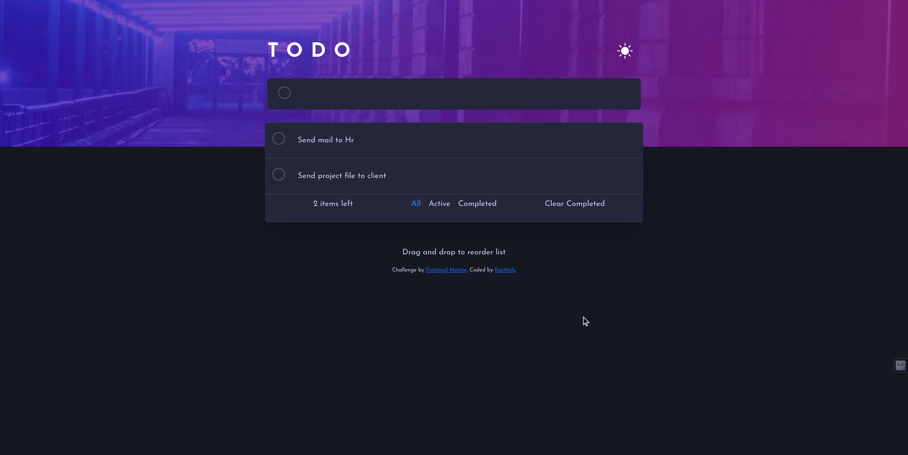
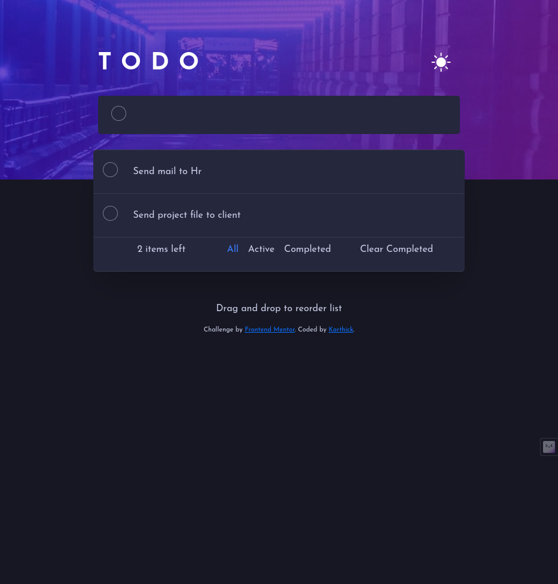
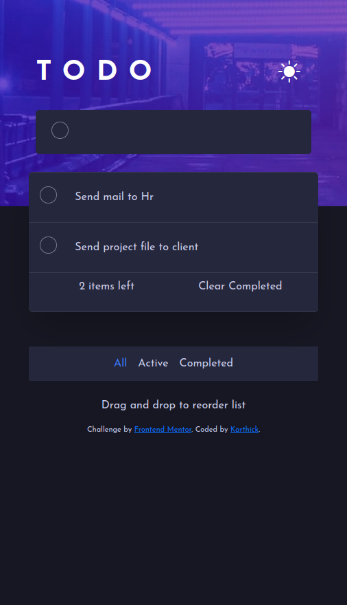
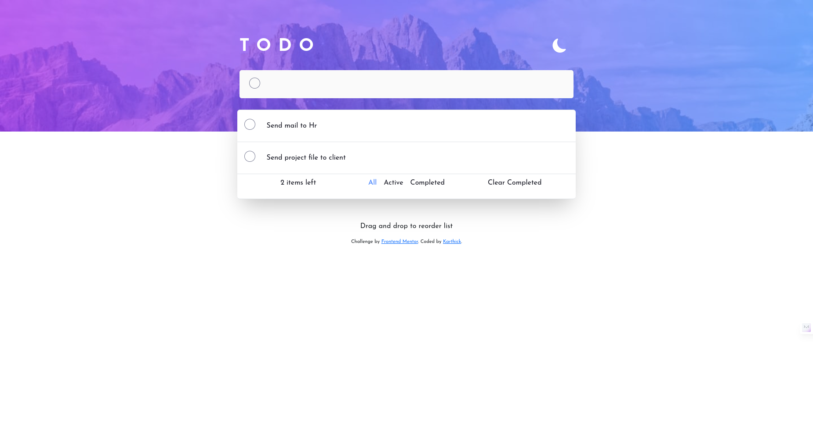
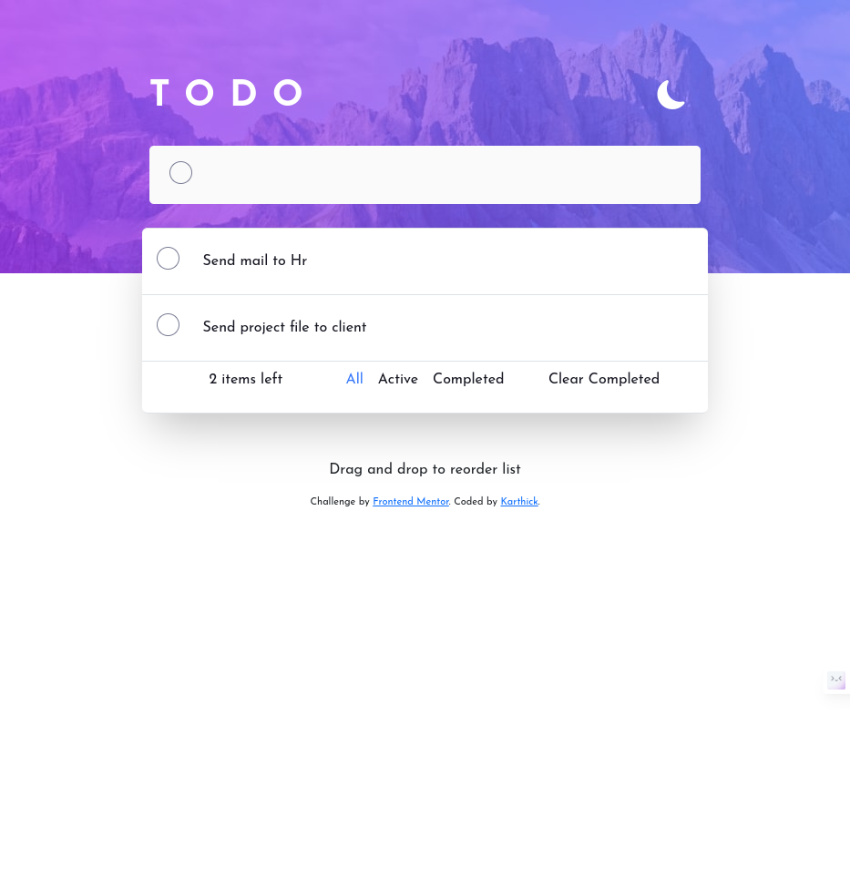
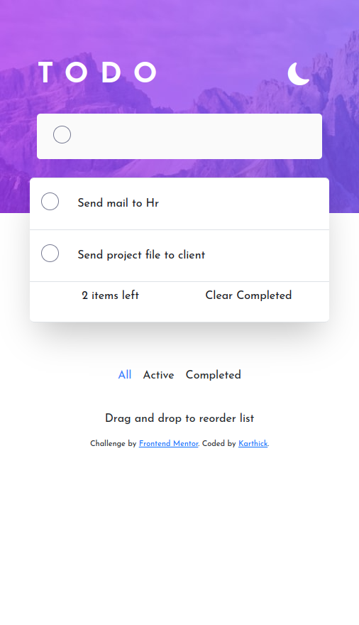

# Frontend Mentor - Todo app solution

This is a solution to the [Todo app challenge on Frontend Mentor](https://www.frontendmentor.io/challenges/todo-app-Su1_KokOW). Frontend Mentor challenges help you improve your coding skills by building realistic projects.

## Table of contents

- [Overview](#overview)
  - [The challenge](#the-challenge)
  - [Screenshot](#screenshot)
  - [Links](#links)
- [Technologies Used](#technologies-used)
- [About this project](#about-this-project)
- [Author](#author)

**Note: Delete this note and update the table of contents based on what sections you keep.**

## Overview

### The challenge

Users should be able to:

- View the optimal layout for the app depending on their device's screen size
- See hover states for all interactive elements on the page
- Add new todos to the list
- Mark todos as complete
- Delete todos from the list
- Filter by all/active/complete todos
- Clear all completed todos
- Toggle light and dark mode
- Drag and drop to reorder items on the list
- Made connection with mongoDb

### Screenshot

  

### Links

- Solution URL: [Solution URL here](https://www.frontendmentor.io/solutions/todo-fullstack-application-oIvMcciGsy)
- Live Site URL: [Live site URL here](https://karthick12122000.github.io/Todo_App)

## Technologies Used

- **Frontend:**

  - HTML
  - CSS
  - Bootstrap (for styling)
  - JavaScript (for interactivity)

- **Backend:**
  - Node.js with Express.js (for server and routing)
  - MongoDB (for database storage)

## About this project

- This full-stack Todo application allows users to efficiently manage their tasks with features such as adding, marking, and deleting todos, along with the ability to filter tasks by status. 
- With a responsive design, users can seamlessly access the application from any device, and the option to toggle between light and dark mode provides a personalized viewing experience. 
- Leveraging technologies such as MongoDB for database management and Express.js for server-side functionality, this project represents a significant milestone in my development journey, showcasing my proficiency in these technologies and marking my first full-stack application.

## Author

- Frontend Mentor - [@karthick12122000](https://www.frontendmentor.io/profile/karthick12122000)
- Linkedin - [@Karthick](https://www.linkedin.com/in/karthick-kaliannan-68b763191/)
